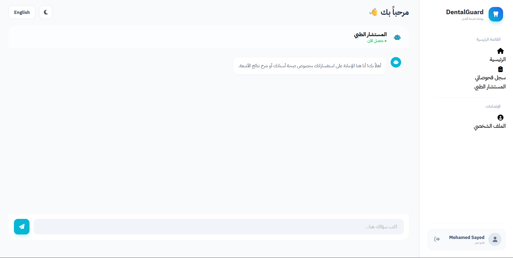
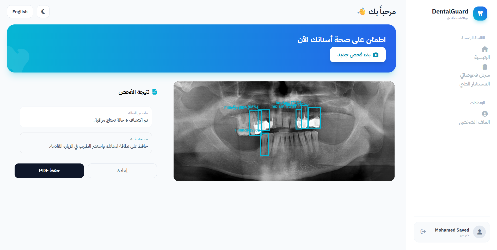
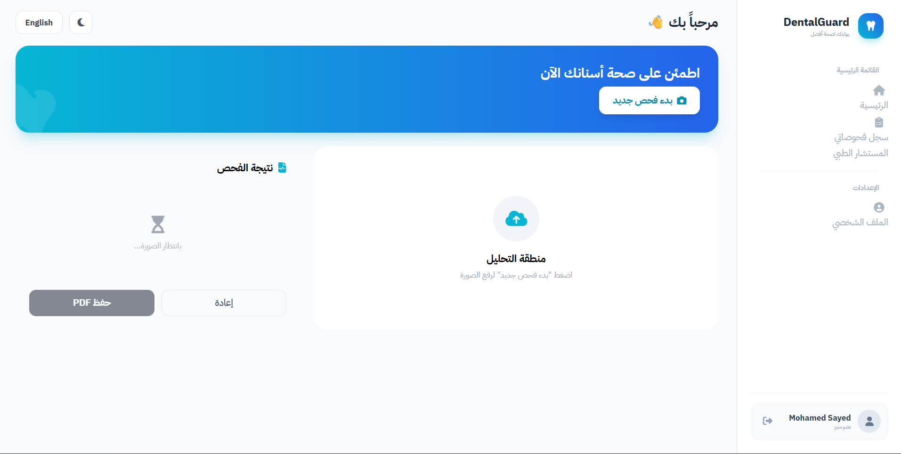
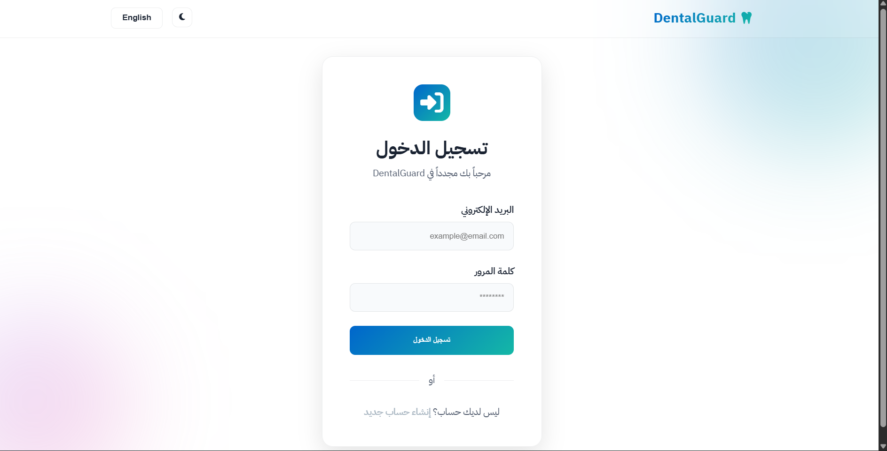
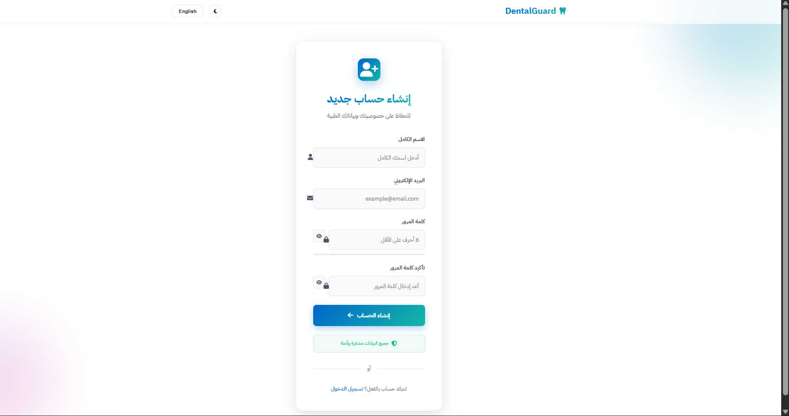
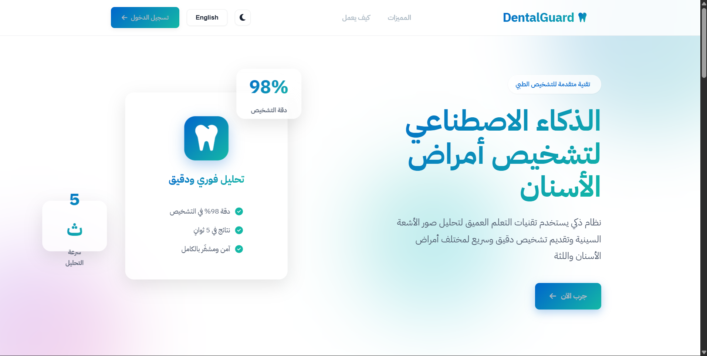

# 🦷 DentalGuard - AI Dental Analysis System

A full-stack web application for dental image analysis using AI.

---

## 🚀 Overview

DentalGuard is a smart system that allows users to upload dental images and receive AI-powered analysis, manage patient data, and track medical history.

---

## ✨ Features

* 🧠 AI-powered dental image analysis
* 📤 Upload X-ray / dental images
* 📊 Dashboard with analysis history
* 👨‍⚕️ Patient management system
* 🌐 Multi-language support
* ⚡ Fast processing (GPU supported)

---

## 🛠️ Tech Stack

* Laravel (Backend)
* Vue.js (Frontend)
* Flask (AI Server)
* SQLite / MySQL
* PyTorch (AI Model)

---

## ⚙️ Installation (Portable Version)

### First Time Setup:

1. Run `setup_portable.py`
2. Wait for installation (~10 minutes)
3. Follow instructions

### Run Project:

1. Double-click `START_PROJECT.bat`
2. Open: http://localhost:8000

---

## 📸 Screenshots

---

## 📌 Important Note

AI model files are not included in this repository due to size limitations.

---

## 💡 Use Cases

* Dental clinics
* Medical AI systems
* Healthcare startups
* Academic projects

---

## 📄 License

Educational / Academic Use Only
